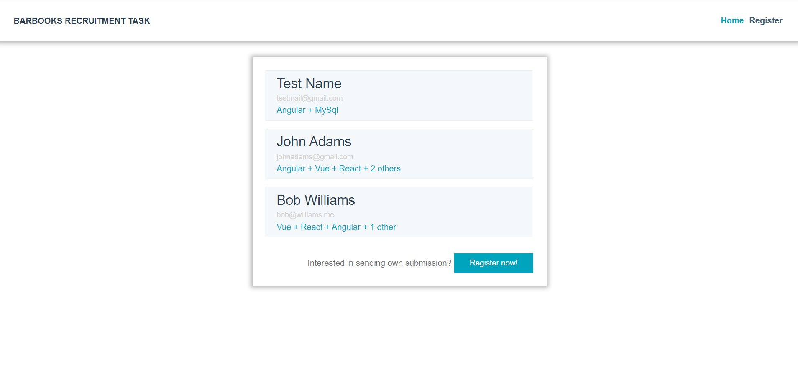
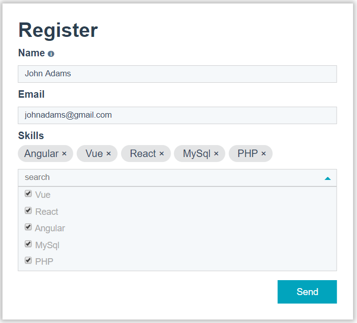

# barbooks-recruitment-task

## Description
BarBooks recruitment task is a mini project, where candidates can register with name, email and selected skills they got and then see their submission.

Project make use of custom sass styles, custom components for form controls and Vuex for storing and managing data.

Whole task took me approximately _still in progress :)_.
## Overview
### Home page

### Register form

## Project setup
```
npm install
```

### Compiles and hot-reloads for development
```
npm run serve
```
